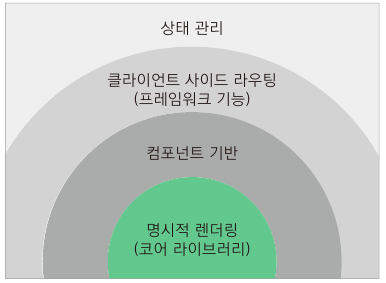

# CH01. Vue 소개

 
 

## Introduction

 

# 1. Vue.js

`Vue.js`는 웹 페이지 화면을 개발하기 위한 Front-End Framework입니다. 다음 그림은 Vue.js의 창시자인 에반 유(Evan You)가 2017년 `Vue.js Conference`에서 발표한 자료에서 사용한 그림입니다.   

 

 

- `Vue Core library` : 화면단 데이터 표현에 대한 기능
- 컴포넌트 기반
- 프레임워크가 일반적으로 가지는 라우팅 기능 지원
- 프레임워크 기능인 상태 관리 같은 기능도 쉽게 결합 가능

 
 

# 2. Vue.js와 다른 Framework의 차이

 

Front-End Web Application의 Framework 시장은 `React와 Angular가 높은 점유율을 차지`하고 있습니다. 상대적으로 오래된 Framework이고 이미 많은 기업에서 도입해서 사용하고 있기 때문입니다.
Vue의 창시자인 에반 유는 원래 구글 엔지니어였는데 이때 Angular를 사용했었습니다.

Angular는 양방향 데이터 바인딩과 같은 수준 높은 기능을 제공하지만 `ES6`, `TypeScript`와 같은 내용을 기본으로 알아야 사용할 수 있으며 프레임워크 구조 자체가 방대하고 복잡해 사용하기 쉽지 않습니다.

React 역시 Angular와 유사한 상황입니다. `ECMAScript 6`를 배워야 하고 `UI를 Template으로 처리하지 않고 JavaScript로 처리하기 때문에 상대적으로 JavaScript를 능숙`하게 다룰 줄 알아야 합니다. 또한 Webpack과 같은 도구에 익숙해야 하죠. 이런 것들이 진입장벽을 높게 합니다.

그래서 Angular의 필수적인 요소들만 이용해서 새로운 화면을 구성하기 시작했고 이것이 오픈소스화 되어 프레임워크화 되면서 `Vue.js`가 탄생했습니다.

`Vue.js는 2014년 2월 처음으로 배포`되었습니다. 그래서 상대적으로 다른 프레임워크에 비해서 점유율이 아직은 낮은 편이나 점점 높아지고 있는 추세입니다.

 
 

# 3. Vue.js 특징

 

## 3.1 사용하는 패턴

Vue는 UI 개발 방법론 중 하나인 `MVVM` 패턴의 `ViewModel`에 해당하는 화면단 라이브러리입니다. `MVVM 패턴`은 화면을 `Model` - `View` - `ViewModel`로 구조화하며 개발하는 방식을 의미합니다.

 

.png)

 
 

## 3.2 컴포넌트 기반 구현

Vue는 `컴포넌트 기반의 프레임워크`입니다. 화면을 컴포넌트로 구조화해서 개발한다는 의미입니다.

 

.png)