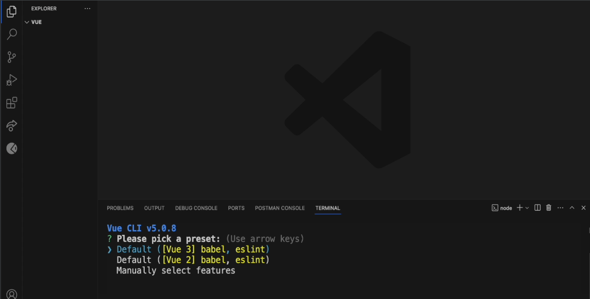

# CH07.  Vue Cli 설치

<br>
<br>

# 1. 프로젝트 설정 도구

<br>

기본적인 내용에 대해 배웠으니 이제 Single File Component 기반으로 Vue application을 개발하는 방법에 대해서 알아보도록 하죠.

<br>

Single File Component는 `컴포넌트 하나를 .vue 파일 하나에 작성하기 때문에 붙여진 이름`입니다. 
한 파일에 컴포넌트 구성을 위해 필요한 template, script, style 정보를 모두 포함하기 때문에 컴포넌트 단위로 관심사 분리(Seperation of Concern)가 이루어질 수 있습니다.
  

Single File Component 기반으로 Vue application을 개발위해서는 Webpack과 같은 모듈 번들러와 ES6, TypeScript와 같은 트랜스파일러를 함께 사용하도록 개발 프로젝트 환경을 설정해야 합니다. 
하지만 이 과정이 순탄치는 않습니다. 그래서 몇가지 프로젝트 설정도구를 사용해서 조금 손쉽게 구현합니다.

<br>
<br>  

# 2. Vue CLI 도구

<br>

### 1) Vue 설치

<br>

- Window

```
npm install -g vue
```

<br>

- Mac

```
sudo npm install -g vue
```

<br>
<br>  

### 2) Vue Cli 설치

<br>

- Window

```
npm install -g @vue/cli 
```

<br>

- Mac

```
sudo npm install -g @vue/cli
```

<br>
<br>
  

### 3) VSCode 작업시  필요한 플러그인 설치

<br>

- Vetur
- Vue Peek
- Vue VSCode Snippets
- Vue3 Snippets

<br>
<br>  

### 4)  Vue 프로젝트 셋업 

<br>

```
vue create todo 
```

<br>
<br>

**→ Default 설치시 아래 참조 선택**

  

<br>


<br>
<br>

**→  Manually 설치시 아래 참조 설치  ( 설치 추천 )**

```
Manually select features     
```

<br>

```
Vue CLI v5.0.8
? Please pick a preset: Manually select features
? Check the features needed for your project: Babel, Router, CSS Pre-processors, Linter
? Choose a version of Vue.js that you want to start the project with 3.x
? Use history mode for router? (Requires proper server setup for index fallback in production) Yes
? Pick a CSS pre-processor (PostCSS, Autoprefixer and CSS Modules are supported by default): Sass/SCSS (with dart-sass)
? Pick a linter / formatter config: Basic
? Pick additional lint features: Lint on save
? Where do you prefer placing config for Babel, ESLint, etc.? In package.json
? Save this as a preset for future projects? (y/N) n
```

<br>
<br> 

## 3. Vue Cli - 작업 프로젝트 설정방식

주의 :  작업폴더 설치시 VSCode에서 설치할 것!  
  
<br>

### 1) Manually Setup

```
)  vue create project-test1

2)
? Please pick a preset:
  Default ([Vue 3] babel, eslint)
  Default ([Vue 2] babel, eslint)
> Manually select features

3)
 ? Please pick a preset: Manually select features
? Check the features needed for your project: (Press <space> to select, <a> to toggle all, <i> to invert selection, and <enter> to proceed)
>(*) Babel
 ( ) TypeScript
 ( ) Progressive Web App (PWA) Support
 ( ) Router
 ( ) Vuex
 ( ) CSS Pre-processors
 (*) Linter / Formatter
 ( ) Unit Testing
 ( ) E2E Testing

4)
? Please pick a preset: Manually select features
? Check the features needed for your project: Babel, Linter
? Choose a version of Vue.js that you want to start the project with (Use arrow keys)
> 3.x
  2.x

5)
? Please pick a preset: Manually select features
? Check the features needed for your project: Babel, Linter
? Choose a version of Vue.js that you want to start the project with 3.x
? Pick a linter / formatter config: (Use arrow keys)
> ESLint with error prevention only
  ESLint + Airbnb config 
  ESLint + Standard config 
  ESLint + Prettier 

6)
? Please pick a preset: Manually select features
? Check the features needed for your project: Babel, Linter
? Choose a version of Vue.js that you want to start the project with 3.x
? Pick a linter / formatter config: Basic
? Pick additional lint features: (Press <space> to select, <a> to toggle all, <i> to invert selection, and <enter> to proceed)
>(*) Lint on save                        <=  (오류 방지 기능만 있는 ESLint)
 ( ) Lint and fix on commit

7)
? Please pick a preset: Manually select features
? Check the features needed for your project: Babel, Linter
? Choose a version of Vue.js that you want to start the project with 3.x
? Pick a linter / formatter config: Basic
? Pick additional lint features: Lint on save
? Where do you prefer placing config for Babel, ESLint, etc.?
  In dedicated config files
> In package.json

8)
? Please pick a preset: Manually select features
? Check the features needed for your project: Babel, Linter
? Choose a version of Vue.js that you want to start the project with 3.x
? Pick a linter / formatter config: Basic
? Pick additional lint features: Lint on save
? Where do you prefer placing config for Babel, ESLint, etc.? In package.json
? Save this as a preset for future projects? (y/N) n

9) 작업폴더 설치시작 됨!
Vue CLI v5.0.8
✨  Creating project in C:\Users\user\Desktop\Vue3\project-test1.
🗃  Initializing git repository...
⚙️  Installing CLI plugins. This might take a while...

10) 설치완료  메세지
🎉  Successfully created project project-test1.
👉  Get started with the following commands:

 $ cd project-test1
 $ npm run serve
```

<br>
<br>  

### 2) Default (\[Vue 3\] babel, eslint) Setup

```
Vue CLI v5.0.8
? Please pick a preset: Default ([Vue 3] babel, eslint)


Vue CLI v5.0.8
✨  Creating project in C:\Users\user\Desktop\Vue3\project-cli-default.
🗃  Initializing git repository...
⚙️  Installing CLI plugins. This might take a while...


added 878 packages, and audited 879 packages in 50s
```

<br>
<br>  

## 4. Vue Cli 템플릿 다운로드

- 아래에서 필요한 템플릿을 다운받아 바로 프로젝트를 시작할 수 있습니다.

<br>

### 템플릿 다운로드
  
1)  Vue Detault 방식 설치 템플릿     :     [다운로드](http://naver.me/xkIOlpEf "http://naver.me/xkIOlpEf")   
2)  Vue manually 방식 템플릿          :     [다운로드](http://naver.me/FNG5eJ6q "http://naver.me/FNG5eJ6q")   
3)  Vue Router 방식 설치 템플릿     :      [다운로드](http://naver.me/5zlTImlD "http://naver.me/5zlTImlD")